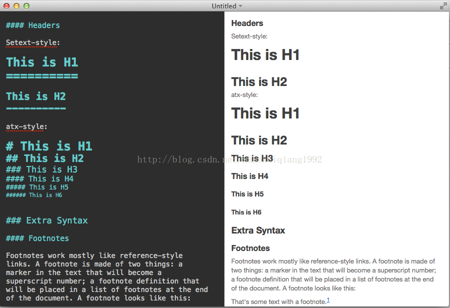
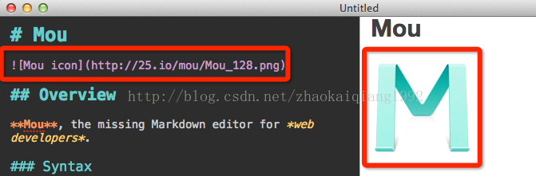
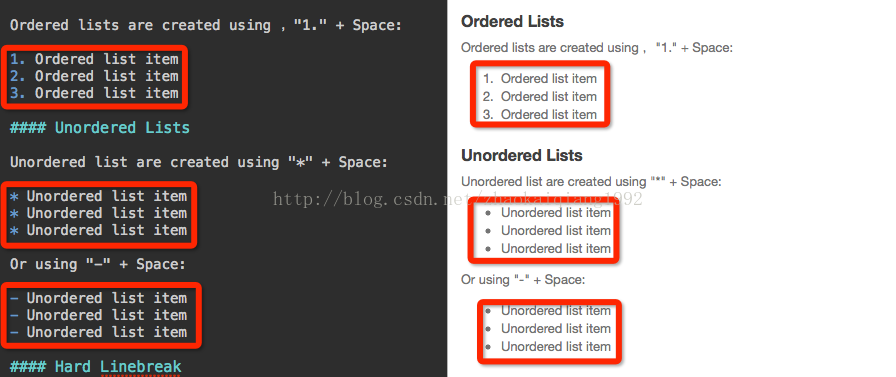

# 简介 
 - Markdown 是一种轻量级标记语言，创始人为约翰·格鲁伯（John Gruber）。它允许人们“使用易读易写的纯文本格式编写文档，然后转换成有效的XHTML(或者HTML)文档”
 - Markdown 的目标是实现「易读易写」。可读性，无论如何，都是最重要的。一份使用 Markdown 格式撰写的文件应该可以直接以纯文本发布，并且看起来不会像是由许多标签或是格式指令所构成。  
 Markdown 语法受到一些既有 text-to-HTML 格式的影响，包括Setext、atx、Textile、reStructuredText、Grutatext 和 EtText，而最大灵感来源其实是纯文本电子邮件的格式。总之， Markdown 的语法全由一些符号所组成，这些符号经过精挑细选，其作用一目了然。  
 比如：在文字两旁加上星号，看起来就像*强调*。Markdown 的列表看起来，嗯，就是列表。Markdown 的区块引用看起来就真的像是引用一段文字，就像你曾在电子邮件中见过的那样。
 - Markdown 语法的目标是：成为一种适用于网络的书写语言,Markdown 的理念是，能让文档更容易读、写和随意改。HTML 是一种发布的格式，Markdown 是一种书写的格式。就这样，Markdown 的格式语法只涵盖纯文本可以涵盖的范围。
 # 常用语法介绍
 - [标题](#标题)  
 标题使用不同数量的"#"来标识是什么层级，可以对应于HTML里面的H1-H6，下面是示例代码和效果
 - [图片](#图片)
 我们可以使用下面的语法，添加一个图片
 语法格式如下：    
 “!”　＋　“[”+ 图片的替代文字 + “]” + “(” + “说明文字” +“)”
 - [强调](#强调)  
`
   *强调* 或者 _强调_ (示例：斜体)  
   
   **加重强调** 或者 __加重强调__ (示例：粗体)   
    
   ***特别强调*** 或者 ___特别强调___ (示例：粗斜体)
 - [代码](#代码)
 使用反引号(esc键下面的按钮)将代码包裹起来  
 `
     @Override  
     public int update(String sql, Object... args) {  
     //清空缓存
         map.clear();
         //更新数据库
         return dao.update(sql,args);
     }
 `
 - [换行](#换行)  
 在需要换行的地方输入至少两个空格，然后回车即可  
 - [引用](#引用)  
 在文章中引用了资料，那么我们可以通过一个右尖括号">"来表示这是一段引用内容。我们可以在开头加一个，也可以在每一行的前面都加一个。我们还可以在引用里面嵌套其他的引用
 - [列表标记](#列表标记)  
 如果我们的内容需要进行标记，那么我们可以使用下面的方式  
   
   - 有序列表：序号. + 空格
  1. 我来阿里
  2. 你来时代峰峻第三方
  3. 你咬我吗  
 无序列表：*或者- + 空格
 - [链接](#链接)  
 加入一个链接，那么我们通过下面的方式添加[链接文字](链接地址)